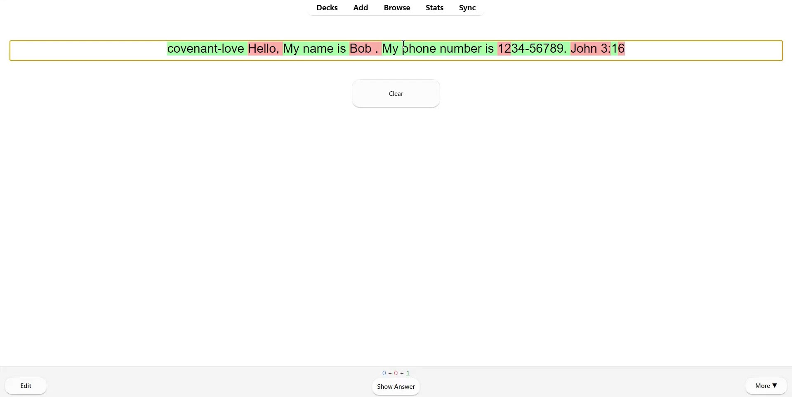

Custom HTML input and Anki template to check your input against a given answer by requiring you to type the first letter of each word.

Open [demo.html](demo.html) in a web browser to see how this works.

You can download a sample Anki template from the [Releases](https://github.com/abdnh/type-first-letters-input/releases) page. See [this video](https://drive.google.com/file/d/1A5Z09REl4iJH8vmZTiMqgftmMeRI6SnK/view?usp=sharing) for a demo.

